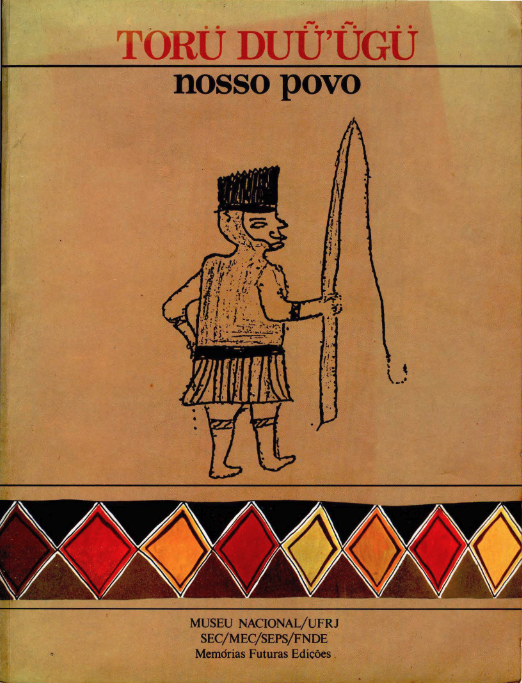

# Projeto 2 de APC 

Este projeto foi desenvolvido como parte da disciplina de Algoritmos e Programação (APC) da Universidade de Brasília (UnB).

## Objetivo
O objetivo deste projeto foi desenvolver um programa em Python que correlacione frases em português com suas traduções correspondentes em Ticuna, imprimindo os pares no formato JSON no terminal. O programa ajusta os textos para garantir a correspondência exata entre as frases em português e suas traduções em Ticuna. Os textos utilizados foram extraídos do livro TORÜ DUǕ'ǕGÜ (Nosso Povo). Esse conjunto de dados bilíngues facilitará a visualização e o uso das traduções para o treinamento de modelos de IA generativa, promovendo a preservação e promoção da língua Ticuna.

## O problema
A maioria dos modelos de IA pré-treinados é otimizada para línguas indo-europeias, o que limita sua aplicação para línguas menos representadas, como o Ticuna. A falta de documentação e recursos digitais para o Ticuna torna desafiador o treinamento de modelos de IA generativa para essa língua. Isso dificulta a criação de tecnologias de IA que possam apoiar e preservar línguas indígenas menos documentadas.
## A solução
Desenvolver um programa que associe frases do texto em português à sua tradução em Ticuna pode ajudar a superar esse desafio. O formato JSON gerado pelo programa facilita a visualização e o uso dos dados bilíngues para o treinamento de modelos de IA generativa adaptados para o Ticuna. Essa abordagem promove a construção de tecnologias mais inclusivas e representativas, ampliando o acesso e a preservação da língua Ticuna.

## Executar a Aplicação
1. Clonar o Repositório:

- Utilize o Git para clonar o repositório para sua máquina local. Execute o seguinte comando no terminal:

      git clone https://github.com/JoaoJorgedosAnjos/projeto_02.git
2. Acessar o Diretório do Projeto:
    
- Navegue até o diretório do projeto clonado:
   
      cd projeto_02
3. Executar a Aplicação:

       python3 projeto_02.py

## Integrantes
### Alunos
- João Jorge
- Natalie Santos 
- Patrícia Tayná
### Professores
- Profª Maristela Holanda
- Prof. Edison Ishikawa
